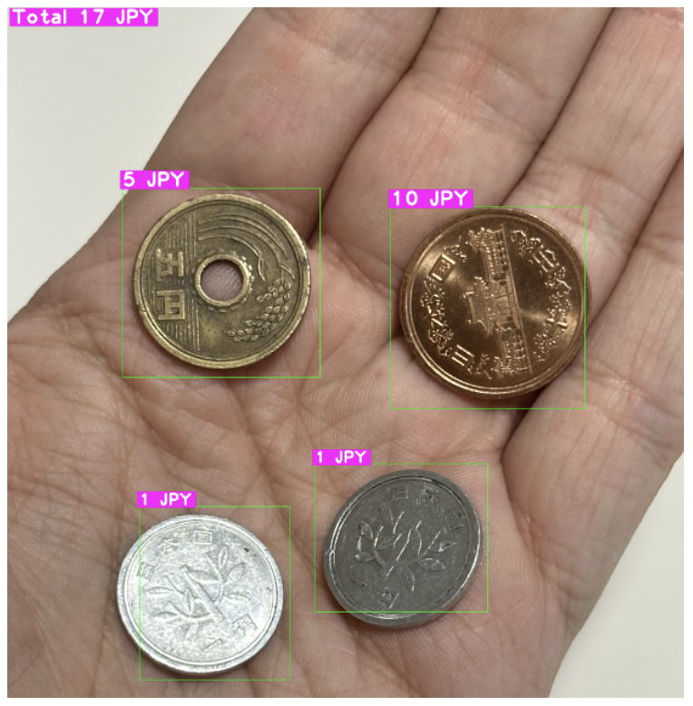
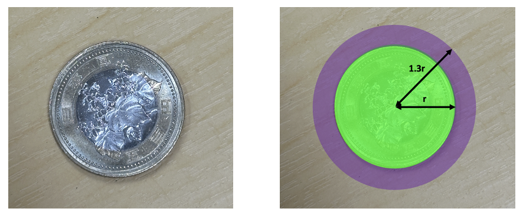
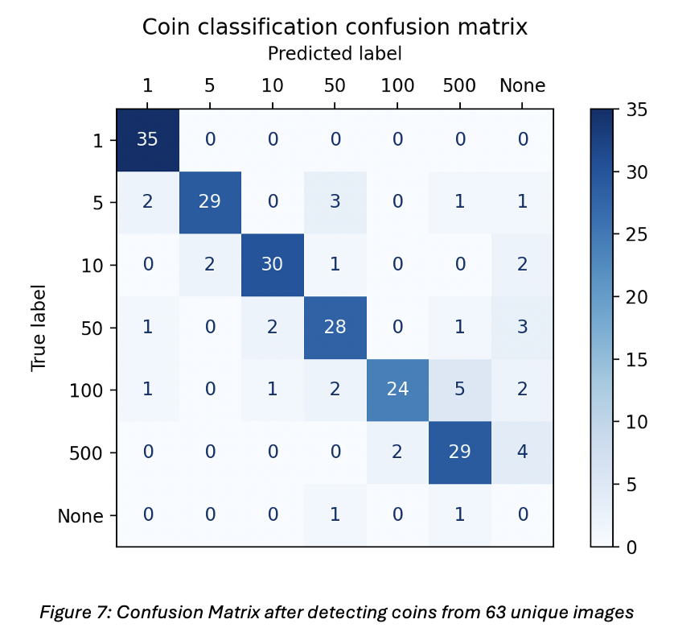
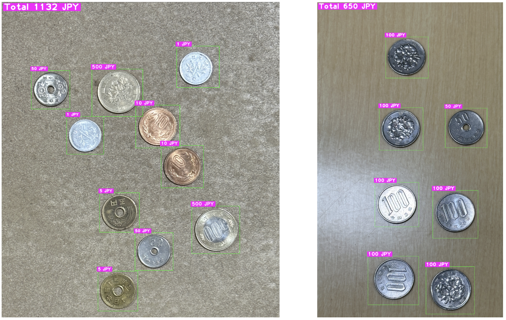
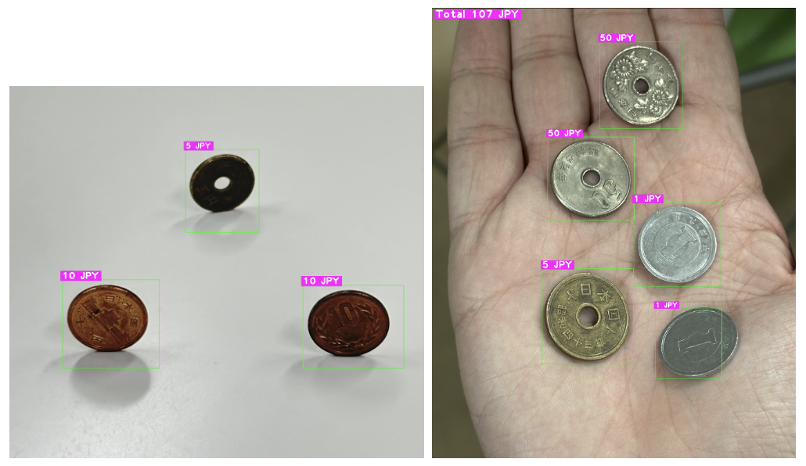

# GrabCut Coin Segmentation and Detector

GrabCut-based pipeline for segmentation and detection of Japanese yen coins, combining classical computer vision and a MobileNetV2-based CNN classifier.

This project was developed as a proof-of-concept addressing the everyday problem of quickly counting mixed Japanese coins placed on a surface.


<p align="center">
  
</p>

---

## Overview

Given a photo of coins lying on a surface, the system:

1. **Segments** individual coins using:
   - Channel selection + CLAHE (contrast-limited adaptive histogram equalization)
   - Gaussian blurring
   - Hough Circle Transform (for coarse coin candidates)
   - A two-stage **GrabCut** graph-cut refinement
   - Area-based noise filtering and bounding-box extraction

2. **Classifies** each segmented coin using a **MobileNetV2** CNN, fine-tuned on Japanese yen coins (1, 5, 10, 50, 100, 500 yen).

3. **Outputs**:
   - A visualization of detected coins with bounding boxes and predicted denominations
   - The total monetary value of all detected coins
   - Evaluation metrics on a test set

---

## Features

- Robust coin segmentation using a graph-cut based method (GrabCut) with Hough circle seeding  
- Lightweight CNN classifier (MobileNetV2) fine-tuned on Japanese yen coin faces  
- Handles different backgrounds, lighting conditions, viewing angles, and zoom levels  
- Evaluation using confusion matrix, precision, recall, multi-class accuracy, and detection rate  
- Visualization of predictions directly on the original image  

---

## Method

### 1. Segmentation

The segmentation pipeline assumes:

- Coins **do not overlap**
- Coins **do not touch each other**

Steps:

1. Extract the **green channel** from the RGB image and apply **CLAHE** to normalize local contrast, as that resulted in the best performance.
2. Apply **Gaussian blur** to reduce noise and unnecessarily small details.
3. Run **Hough Circle Transform** to find rough candidate circular regions.
4. For each candidate, build a GrabCut seed mask:
   - Inner disc (radius *r*): foreground  
   - Outer disc (radius *1.3r*): probable foreground
<p align="center">
  
</p>

5. Run **GrabCut twice**:
   - First to refine coin regions around candidate circles
   - Second to refine the overall segmentation
6. Remove segments that are unrealistically small or large relative to image area.
7. Create padded bounding boxes around each remaining coin.

### 2. Classification

For each segmented coin:

1. Add a small safety padding around the coin within image bounds.
2. Convert the coin crop to **YUV** and apply CLAHE on the Y-channel to enhance contrast without distorting color.
3. Resize to **224×224** (MobileNetV2 input size).
4. Feed into a **MobileNetV2** model:
   - Pretrained on ImageNet
   - Fine-tuned on a dataset of Japanese yen coins:
     - ~45 training images per denomination
     - ~5 validation images per denomination
5. Use a softmax output with 6 classes (1, 5, 10, 50, 100, 500 yen).
6. Accept a prediction only if the model confidence is **≥ 40%**, otherwise treat it as “None”.

---

## Results

The model was evaluated on **63 unseen test images** with a balanced distribution of coin denominations (35 coins per class).

**Global metrics:**

- **Average Detection Rate per Image:** 84.46%  
- **Average Precision per Denomination:** 87.48%  
- **Average Recall per Denomination:** 82.95%  
- **Multi-Class Accuracy:** 82.16%

**Confusion matrix:**
<p align="left">
  
</p>


**Per-denomination (Recall / Precision):**

| Denomination (¥) | Recall (%) | Precision (%) |
|------------------|-----------:|--------------:|
| 1                | 100.00     | 89.74         |
| 5                | 80.56      | 93.55         |
| 10               | 85.71      | 90.91         |
| 50               | 80.00      | 80.00         |
| 100              | 68.57      | 92.31         |
| 500              | 82.86      | 78.38         |

In general, the system:

- Rarely **hallucinates** non-existent coins (high precision)
- More often **misses** difficult coins (lower recall), especially 100-yen coins due to visual similarity with 50-yen and 500-yen coins and weaker surface features.


## Report

For full details, see the project report:

[***What's in my pocket?*** - *A Graph-cutting & Neural Network-based Coin Detector*](report/grabcut_coin_report.pdf)

---

## Examples

<p align="center">
  
</p>

<p align="center">
  
</p>

## Installation

```bash
git clone https://github.com/kevinkokalari/grabcut-coin-segmentation-and-detector.git
cd grabcut-coin-segmentation-and-detector

python -m venv .venv
source .venv/bin/activate   # On Windows: .venv\Scripts\activate

pip install -r requirements.txt
```

## Usage

To train the CNN, replace the example images and denomination folders with your own data, then run:
```bash
python3 CNN.py
```

To run the detector, add your own test images in the test folder as well as the JSONL file 'labels.jsonl' with the true labels, then run:
```bash
python3 detector.py
```
